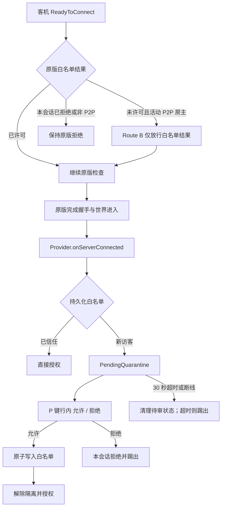

# SteamP2PFriends Route B 缺陷修复执行报告 - 0.2.3.64

## 一、问题定位与修复策略

### 根因

原先的“白名单拒绝后等待房主审核并自动重连”发生在原版 `ReadyToConnect` / `SteamPending` 握手阶段。U3-SDK 在该阶段会先以 `SteamWhitelist.checkWhitelisted(steamID)` 的结果拒绝未白名单玩家；客机若仍在原版排队、资源加载或网络延迟阶段，30 秒审核倒计时可能已开始，导致未真正进入房间即超时或被限流。

本轮采用 Route B：仅对活动 SteamUser P2P 房主的有效远端、且未被本会话拒绝的 SteamID 放宽该一个白名单结果。原版封禁、地址限速、人数、密码和后续身份检查保持原逻辑。玩家已被原版添加为 `SteamPlayer` 后，才由 `Provider.onServerConnected` 进入待审核隔离。

U3-SDK 源码依据：

- `ServerMessageHandler_ReadyToConnect.cs:424-439` 先检查白名单，随后仍继续人数和密码检查。
- `Provider.cs:4955-4972` 在 `SteamPlayer` 已建立及初始状态发送后才调用 `onServerConnected`。

### 生命周期

### 修复策略

1. 新增 `P2PApprovalManager`，以 `ConcurrentDictionary` 管理待审和本会话拒绝状态；将新访客的审核时钟起点移动至世界进入后。
2. 新增白名单 Postfix，仅替换 Route B 合格客机的 `checkWhitelisted` 返回结果。
3. 新增 P 键玩家行装饰器，同时挂载 `OnCreatePlayerEntry` 与 `OnCreatePlayerEntryWithGrouping`；无 UI 引用缓存，避免刷新或断线留下悬挂引用。
4. 将服务端 Invoke、伤害保护、客机输入抑制切换为 Route B 的 `IsPending` 判断；批准前阻止交互并保持无敌。
5. 将启动自检从已停用的旧预留链路迁移到 Route B 的实际补丁、生命周期钩子、两类 P 键行工厂和信号位，防止 `DiagnosticBuildValid` 被旧依赖错误置为失败。
6. 取消 Route B 下 `WHITELISTED` / 限流失败启动旧自动重连等待循环的路径，真实失败统一走普通失败提示。

## 二、源码溯源清单

| 需求点 | 实现位置 | 证据 |
| --- | --- | --- |
| 握手不悬挂，保留其他原版检查 | `Patches/Patch_ServerConnectValidation.cs` | 仅在 `CanPermitHandshake` 为真时改写白名单结果 |
| 世界进入后登记隔离 | `Host/P2PApprovalManager.cs` | `Provider.onServerConnected` 订阅后调用 `RegisterConnected` |
| 并发待审、断线、超时 | `Host/P2PApprovalManager.cs` | `ConcurrentDictionary`、`ForgetDisconnected`、`Tick` |
| 批准后持久化并解除隔离 | `Host/P2PApprovalManager.cs` | `TryAdd` 成功后删除待审、清除信号、通知客机 |
| P 键两种玩家行均可审批 | `Patches/Patch_PlayerDashboardPlayersUI.cs` | 双行工厂同时登记并按 owner + MethodInfo 验证 |
| 待审行为限制 | `Patches/P2PQuarantineAdmissionPatches.cs`、`Patches/P2PQuarantineClientInputPatch.cs` | Invoke 门、伤害门、输入门均查询 `P2PApprovalManager.IsPending` |
| Route B 不走旧审批重连 | `Client/P2PJoinManager.cs` | `UsesRouteB` 时跳过 `P2PApprovalWaitController.HandleRetryFailure` |
| 新启动门禁 | `SteamP2PFriendsPlugin.cs` | 验证新握手 Postfix、生命周期、P 键两行工厂、Invoke 门和信号位 |
| 状态机回归 | `WhitelistTests/RouteBApprovalTests.cs` | B1-B8 覆盖放行、隔离、并发、批准、持久化失败、拒绝、断线、超时 |

## 三、核心时序说明

1. 客机发送 `ReadyToConnect`；原版先完成封禁、地址限速等前置检查。
2. 原版查询白名单。Route B 仅对活动 P2P 房主的一次合格新访客返回许可；拒绝过的 SteamID 保持拒绝。
3. 原版继续人数、密码、身份等检查，创建远端 `SteamPlayer` 并发送初始状态。
4. `Provider.onServerConnected` 回调中：已信任玩家直接授权；新玩家登记 `PendingQuarantine`，写入隔离信号并发送“等待房主审核”提示。
5. 房主 P 键重绘玩家行时，待审玩家行展示“允许”和“拒绝”。允许先持久化白名单，成功后解除限制；拒绝、超时或断线均删除待审状态，拒绝/超时会安全踢出。

## 四、核心代码变更

### 新增文件

- `Host/P2PApprovalManager.cs`
- `Patches/Patch_ServerConnectValidation.cs`
- `Patches/Patch_PlayerDashboardPlayersUI.cs`
- `WhitelistTests/RouteBApprovalTests.cs`

### 修改文件

- `SteamP2PFriendsPlugin.cs`
- `Host/HostManager.cs`
- `Client/P2PJoinManager.cs`
- `Client/P2PQuarantineClientView.cs`
- `Patches/P2PQuarantineAdmissionPatches.cs`
- `Properties/AssemblyInfo.cs`
- `SteamP2PFriends.csproj`
- `WhitelistTests/Program.cs`
- `WhitelistTests/Stage7_5Tests.cs`
- `WhitelistTests/Stage7_6Tests.cs`
- 其余兼容性和测试项目登记文件。

## 五、编译与自测状态

| 项目 | 命令 | 结果 |
| --- | --- | --- |
| 插件 | `MSBuild.exe SteamP2PFriends.csproj /t:Rebuild /p:Configuration=Release` | 0 errors / 0 warnings |
| 测试程序 | `MSBuild.exe WhitelistTests/SteamP2PFriends.WhitelistTests.csproj /t:Rebuild /p:Configuration=Release` | 0 errors / 0 warnings |
| 全量回归 | `WhitelistTests/bin/Release/SteamP2PFriends.WhitelistTests.exe` | 277 / 277 PASS |

最终产物：`bin/Release/SteamP2PFriends.dll`

- AssemblyVersion：`0.2.3.64`
- SHA-256：`6B179CA8D80507FC6CA8FFE5E2FCF571E250FE2423C099C7029C39F0D4A8EBD4`

## 六、独立审核记录

审核轮次：第 1 轮，结论：PASS。

| 审核项 | 判定 | 说明 / 证明位置 |
| :--- | :--- | :--- |
| 需求符合性 | 通过 | 新握手放行、世界后隔离、P 键两类行工厂、批准/拒绝/超时均已落地 |
| 并发与清理 | 通过 | `ConcurrentDictionary`、容量边界、断线删除、超时 `TryRemove` 后单次踢出 |
| 启动门禁 | 通过 | 不再依赖旧 ReadyToConnect scope 或旧行装饰器；验证真实 Route B 依赖 |
| 旧自动重连隔离 | 通过 | `P2PJoinManager` 在 Route B 下不调用旧等待控制器 |
| 构建与测试 | 通过 | 审核者独立复跑，277 / 277 PASS |

非阻断建议：当前隔离信号位的门禁检查为高位常量比较；未来若游戏枚举占用该高位，应将旧的 `Enum.GetValues` 冲突扫描迁入 `P2PApprovalManager` 并纳入门禁。当前 U3-SDK 未占用该位，不阻断本版本。

## 七、最终结论与运行时待测门

修复完成，静态构建、全量回归和独立审核均通过，可移交双机验证。

静态结论不等于双机运行验收。用同一 DLL 哈希部署至主客机后，仍须归档双端日志并验证：

1. 房主出现 `Route B handshake permit`、`Pending added` 和 `DiagnosticBuildValid=true`。
2. 客机实际进入世界且受隔离，P 键普通行与分组行均能显示允许/拒绝。
3. 批准后出现 `Approve success`，客机限制解除并已写入白名单。
4. 拒绝、30 秒超时、客机自行断线及多客机同时进入均无旧 `approval wait` / 自动重连，也无状态或 UI 残留。
